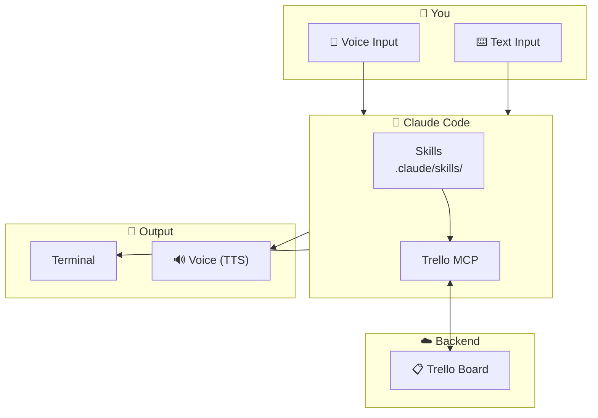
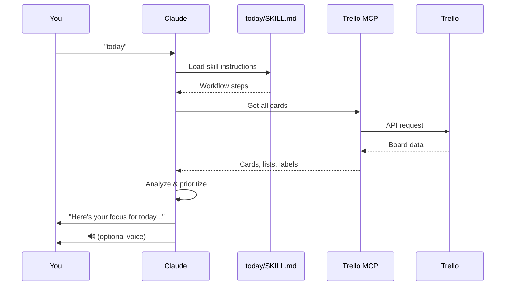
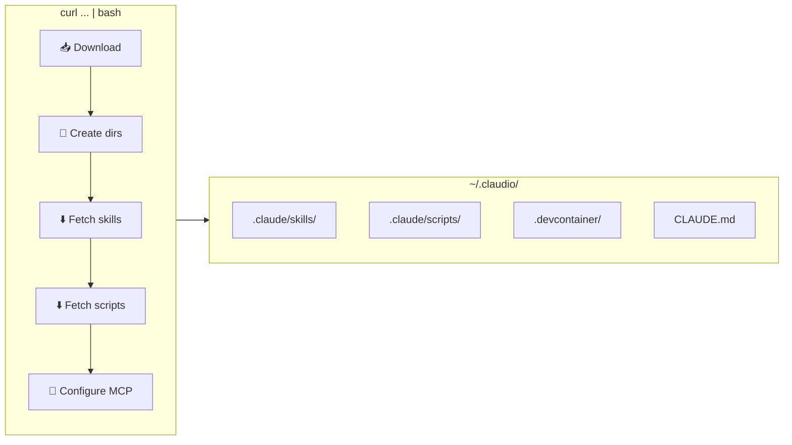
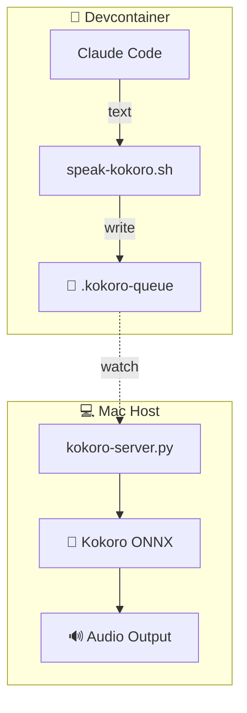
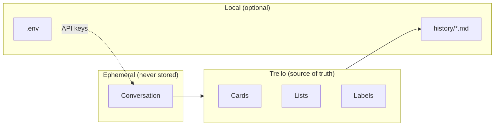

  

# Architecture

How Claudio works under the hood.

## System Overview

## Skill Flow

When you say something like "today", here's what happens:

## Installation Flow

## Voice Architecture

## Data Flow

## Component Responsibilities

| Component | Purpose |
|-----------|---------|
| **Skills** | Define workflows - what Claude does for each command |
| **Trello MCP** | Bridge between Claude and Trello API |
| **Scripts** | TTS, setup utilities |
| **Devcontainer** | Consistent development environment |
| **CLAUDE.md** | Global context for Claude about your setup |
| **history/** | Optional daily logs for pattern tracking |
