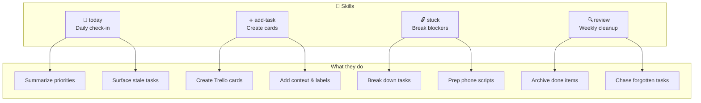
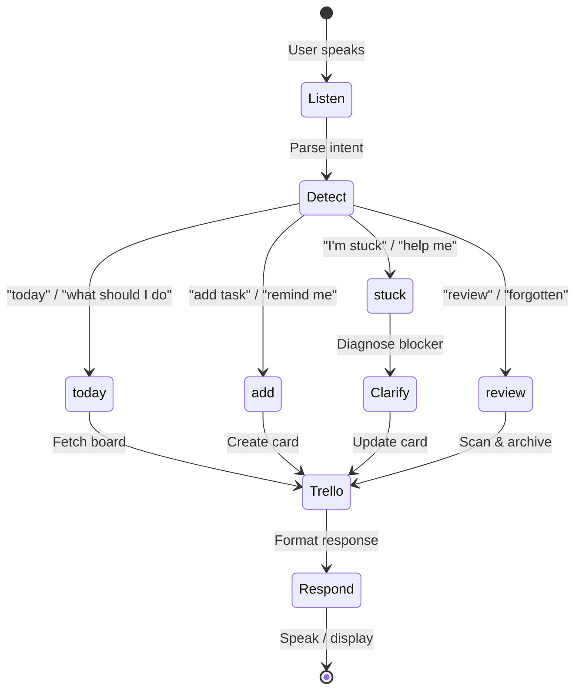

<p align="center">
  
</p>

# Skills

Skills are workflow definitions that tell Claude how to help with specific tasks. Each skill has trigger phrases, a structured workflow, and examples.

## Available Skills



---

## today

**Daily check-in and prioritization.**

| Triggers | `today`, `what should I do`, `morning review`, `what's on my plate` |
|----------|-----|
| **Does** | Fetches board, summarizes top priorities, surfaces stale items |
| **Full docs** | [`skills/today/SKILL.md`](../skills/today/SKILL.md) |

```text
You: today

Claudio: Good morning! Here's your focus for today:

🎯 Focus
  • Call bank about overdraft fees (📞 Admin)
  • Submit expense report (⏰ due tomorrow)

⏳ Waiting On
  • Insurance claim - 5 days since submitted

👻 Gone Cold
  • "Research nurseries" has been in To Do for 3 weeks
```

---

## add-task

**Create well-formed, actionable Trello cards.**

| Triggers | `add task`, `remind me to`, `I need to`, `put on the board` |
|----------|-----|
| **Does** | Clarifies if needed, creates card with title, description, labels, list |
| **Full docs** | [`skills/add-task/SKILL.md`](../skills/add-task/SKILL.md) |

```text
You: remind me to call the dentist about the kids' checkups

Claudio: Created card in To Do:
  📋 "Call dentist re: kids' checkups"
  Labels: 📞 Calls, 👶 Childcare
  Description: Schedule routine checkups for both kids
```

---

## stuck

**Help break down blockers or prep for action.**

| Triggers | `I'm stuck on`, `help me with`, `I keep avoiding`, `help me call` |
|----------|-----|
| **Does** | Diagnoses blocker, breaks into steps, preps phone scripts |
| **Full docs** | [`skills/stuck/SKILL.md`](../skills/stuck/SKILL.md) |

```text
You: I'm stuck on disputing the parking fine

Claudio: Let's break this down. What's blocking you?

You: I need to call them but I don't know what to say

Claudio: Here's a script:

📞 Call: Council Parking Services
🔢 Reference: PCN-2024-12345

"Hi, I'm calling to dispute penalty charge notice
PCN-2024-12345. I believe this was issued in error
because [reason]. I have photos showing [evidence]."

Questions they might ask:
• Date and location of the ticket
• Your vehicle registration
• Reason for dispute

Want me to move this to In Progress?
```

---

## review

**Surface forgotten tasks and clean up the board.**

| Triggers | `review`, `what have I forgotten`, `weekly review`, `clean up` |
|----------|-----|
| **Does** | Finds stale tasks, archives done items, suggests actions |
| **Full docs** | [`skills/review/SKILL.md`](../skills/review/SKILL.md) |

```text
You: what have I forgotten?

Claudio: Let's review your board:

🔴 Overdue
  • "Pay council tax" - due 3 days ago!

🟠 Gone Cold (Waiting On > 7 days)
  • "Insurance claim" - 12 days, no response

🟡 Sitting Too Long (To Do > 14 days)
  • "Research nurseries" - 21 days
  • "Book car service" - 18 days

🟣 Stuck in Progress
  • "Organize garage" - 2 weeks, no movement

What would you like to do with these?
```

---

## Skill Interaction Flow



---

## Creating Your Own Skills

See [CONTRIBUTING.md](../CONTRIBUTING.md) for how to add new skills.

Basic structure:

```text
skills/
└── my-skill/
    └── SKILL.md      # Workflow definition
```

Every skill needs:

1. **Triggers** - When to use it
2. **Workflow** - Step-by-step what to do
3. **Examples** - Input/output samples
