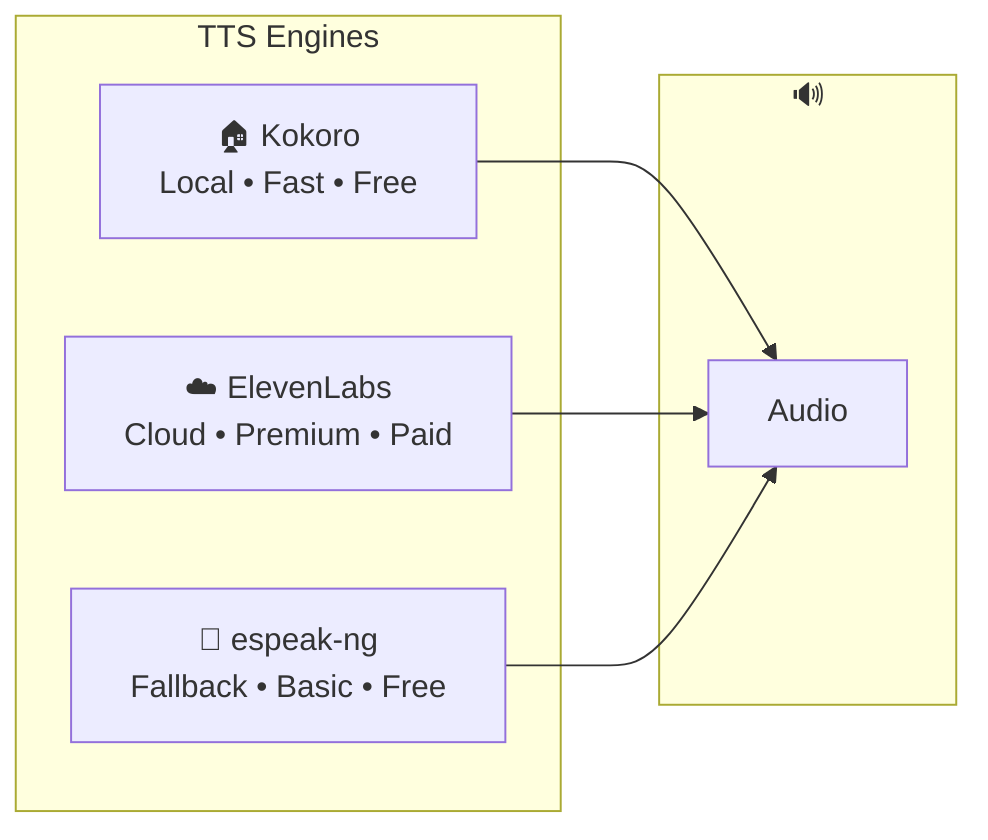
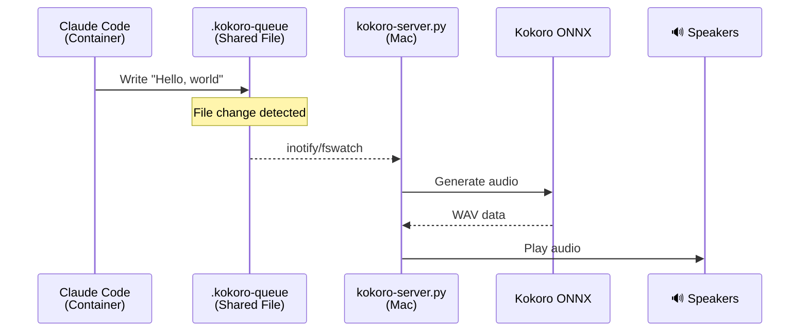
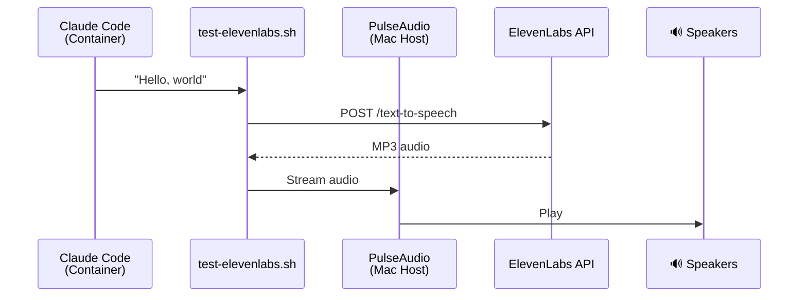
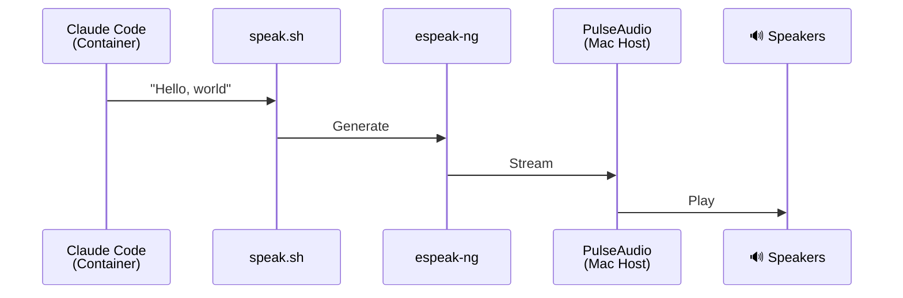

<p align="center">
  
</p>

# Voice Support

Claudio can speak! This page covers the three TTS engines available.

## Overview



## Comparison

| Engine | Quality | Latency | Cost | Platform | Best For |
|--------|---------|---------|------|----------|----------|
| **Kokoro** | ⭐⭐⭐⭐ Great | ~300ms | Free | Mac (Apple Silicon) | Daily use |
| **ElevenLabs** | ⭐⭐⭐⭐⭐ Excellent | ~1.5s | Paid | Any | Premium experience |
| **espeak-ng** | ⭐⭐ Basic | Instant | Free | Any | Fallback |

## Kokoro (Recommended)

Local TTS using [Kokoro ONNX](https://github.com/thewh1teagle/kokoro-onnx) - runs entirely on your Mac with Apple Silicon acceleration.

### How It Works



### Setup

```bash
# One-time setup (installs PulseAudio, Python deps, downloads model)
~/.claudio/.claude/scripts/setup-speech.sh

# Start the server (run in a separate terminal)
~/.claudio/.claude/scripts/kokoro-server.sh ~/.claudio
```

### Server UI

The Kokoro server shows a live terminal UI:

```text
╭─────────────────────────────────────────────────────────────╮
│  🎙️  Kokoro TTS Server                                      │
│                                                             │
│  Status: ● Listening                                        │
│  Voice:  af_heart                                           │
│  Queue:  /Users/you/.claudio/.kokoro-queue                  │
│                                                             │
│  Recent:                                                    │
│  ├─ "Here's your focus for today..."                       │
│  ├─ "Task added: Call the dentist"                         │
│  └─ "I've moved that to Done"                              │
╰─────────────────────────────────────────────────────────────╯
```

### Available Voices

| Voice ID | Description |
|----------|-------------|
| `af_heart` | Default, warm and friendly |
| `af_bella` | Clear and professional |
| `af_sarah` | Soft and calm |
| `am_adam` | Male, neutral |
| `am_michael` | Male, warm |

Change voice:

```bash
~/.claudio/.claude/scripts/kokoro-server.sh ~/.claudio af_bella
```

## ElevenLabs

Cloud-based premium TTS with natural intonation.

### How It Works



### Setup

1. Get an API key from [elevenlabs.io](https://elevenlabs.io)

2. Add to `~/.claudio/.env`:

   ```text
   ELEVEN_API_KEY=your_key_here
   ```

3. Start PulseAudio on your Mac:

   ```bash
   pulseaudio --load=module-native-protocol-tcp --exit-idle-time=-1
   ```

4. Test:

   ```bash
   ~/.claudio/.claude/scripts/test-elevenlabs.sh "Hello from ElevenLabs"
   ```

### Voice Selection

Default voice is "Daniel" (Steady Broadcaster). To change, edit `test-elevenlabs.sh`.

## espeak-ng (Fallback)

Basic TTS built into the devcontainer. Not as natural but always available.

### How It Works



### Setup

Just needs PulseAudio running on your Mac:

```bash
pulseaudio --load=module-native-protocol-tcp --exit-idle-time=-1
```

Test:

```bash
~/.claudio/.claude/scripts/speak.sh "Hello from espeak"
```

## Troubleshooting

### No audio on Mac

1. Check PulseAudio is running:

   ```bash
   pulseaudio --check && echo "Running" || echo "Not running"
   ```

2. Restart PulseAudio:

   ```bash
   pulseaudio --kill
   pulseaudio --load=module-native-protocol-tcp --exit-idle-time=-1
   ```

### Kokoro server not picking up text

1. Check the queue file exists and is writable
2. Ensure the server is watching the correct directory
3. Check server logs for errors

### ElevenLabs returns error

1. Verify API key is set in `.env`
2. Check your API quota at elevenlabs.io
3. Ensure you're not rate-limited
